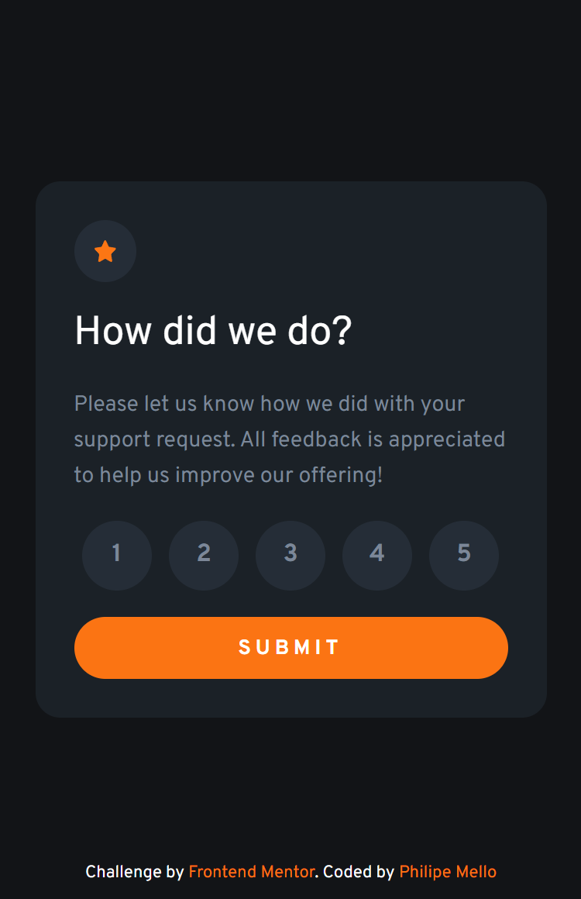
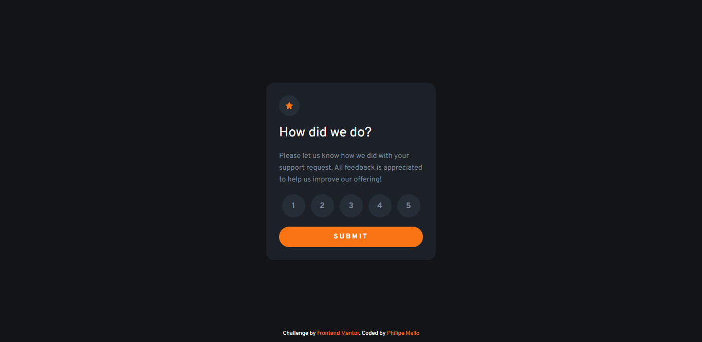
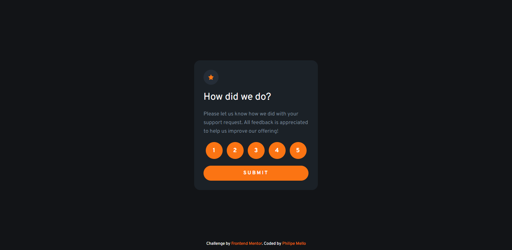

# Frontend Mentor - Interactive rating component solution

This is a solution to the [Interactive rating component challenge on Frontend Mentor](https://www.frontendmentor.io/challenges/interactive-rating-component-koxpeBUmI).

## Overview

### The challenge

Users should be able to:

- View the optimal layout for the app depending on their device's screen size
- See hover states for all interactive elements on the page
- Select and submit a number rating
- See the "Thank you" card state after submitting a rating

### Screenshot

 - Mobile

 - Desktop

 - Active states

### Links

- Solution URL: [GitHub](https://github.com/Philipessj1/Interactive-rating-component)
- Live Site URL: [GitHub Pages](https://philipessj1.github.io/Interactive-rating-component/)

## My process

### Built with

- Semantic HTML5 markup
- CSS custom properties
- CSS Grid
- CSS FlexBox
- CSS Variables
- CSS Pre-Processor (Scss)
- Mobile-first workflow
- Javascript DOM

## Author

- GitHub - [Philipe Mello](https://github.com/Philipessj1)
- Frontend Mentor - [@philipessj1](https://www.frontendmentor.io/profile/Philipessj1)
